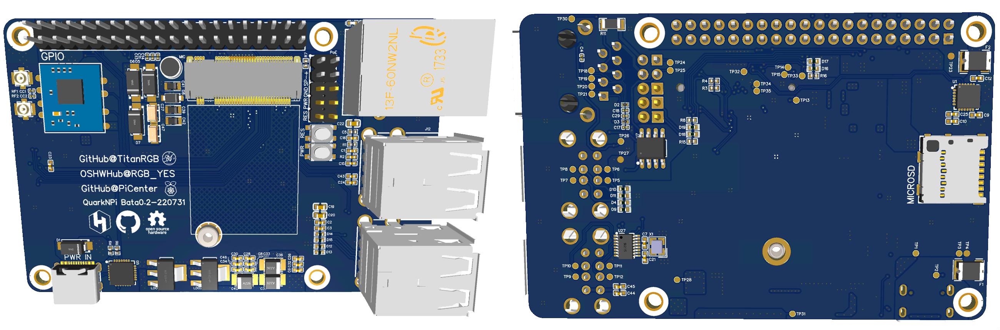

# QuarkNPi `v0.2` **已验证**

 

`If English translation needed, use issue to let me know.`

基于 树莓派4 Raspberry Pi 4 的布局的 Quark N 底板。核心板为稚晖君的 [Project Quantum](https://github.com/peng-zhihui/Project-Quantum) 项目。

此底板特点：

- 引出更多信号线到GPIO脚
- 核心板原生有RJ45引脚，此底板接出了端子
- 增加了一个USB一分四芯片，实际使用了一分二。四个USB接口为2原生+2HUB
- 板上供电使用了独立的LDO（稚晖君的底板使用核心板上的LDO进行稳压）可提供更高功率
- GPIO的供电有专门的保护和稳压电路

加工工艺：

- 嘉立创普通4层板可做
- 最小线宽/线间距：0.127mm（5mil）
- 最小过孔：0.2&0.5mm
- 全通孔，无盲埋孔

